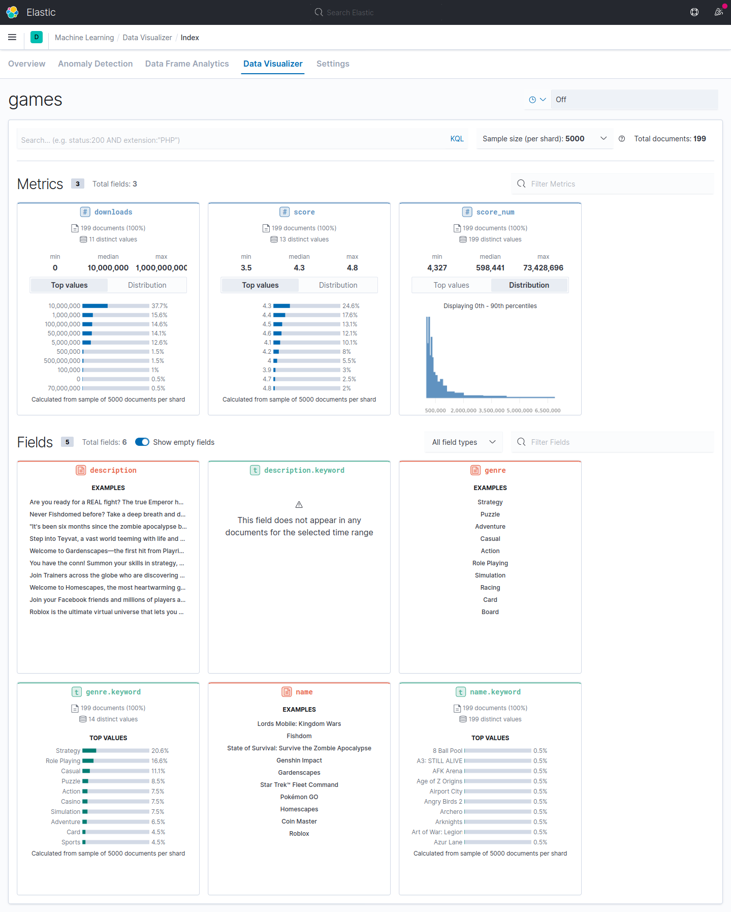
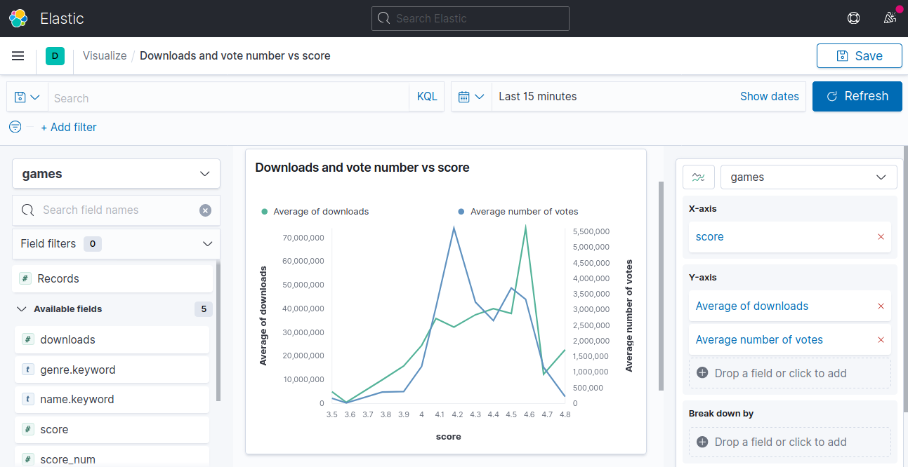

# Google play store crawler

Write a crawler to extract game attributes (Max 300 games) and store them in Elasticsearch. Using Kibana, visualize the stered data.

* Visualize data in Kibana 

* Genre visualization in Kibana 

* Downloads and vote number vs score in Kibana 

## How to run

First setup [Elasticsearch](https://github.com/sshmo/Snippets/blob/master/Elasticsearch.md).

Step 1 — clone the repo:
  
    mkdir crawler
    cd crawler
    git clone https://github.com/sshmo/game_crawler.git .

Step 2 — Set Up Python
    
    sudo apt update
    sudo apt install python3-pip python3-dev
    
Step 3 — Create a Python Virtual Environment for Jupyter

    sudo -H pip3 install --upgrade pip
    sudo -H pip3 install virtualenv
    mkvirtualenv scrap
    workon scrap
    
Step 4 — Install requirements

    pip3 install -r requirements.txt
  
Step 5 — Run scrapy
        
    scrapy crawl games_sel -o games.jl

Step 6 — Run elasticsearch_db.py
        
    python elasticsearch_db.py games.jl

Now you can see the result at: http://localhost:9200/games/_search

## Specifications

* The data should be extracted from the following link (two layers):

[Top grossing games](https://play.google.com/store/apps/collection/cluster?clp=0g4YChYKEHRvcGdyb3NzaW5nX0dBTUUQBxgD:S:ANO1ljLhYwQ&gsr=ChvSDhgKFgoQdG9wZ3Jvc3NpbmdfR0FNRRAHGAM%3D:S:ANO1ljIKta8)

The following attributes are of intrest:
1. Game name
2. Game genere
3. Number of downloads
4. Score value and number
5. Description

* Use Kibana for data visualization
* Retale Downloads and vote number to score, using Kibana 

* TODO

    Visualize the words frequency in game description using Kibana
